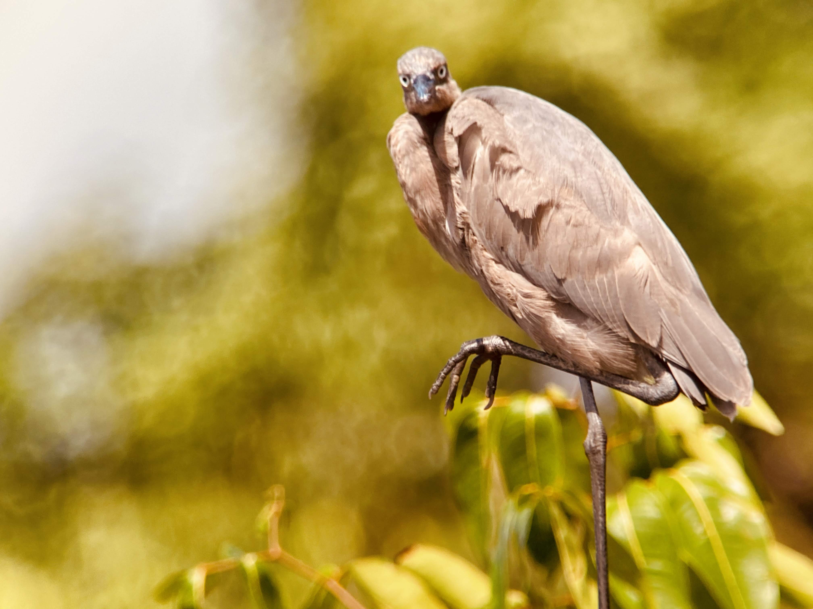
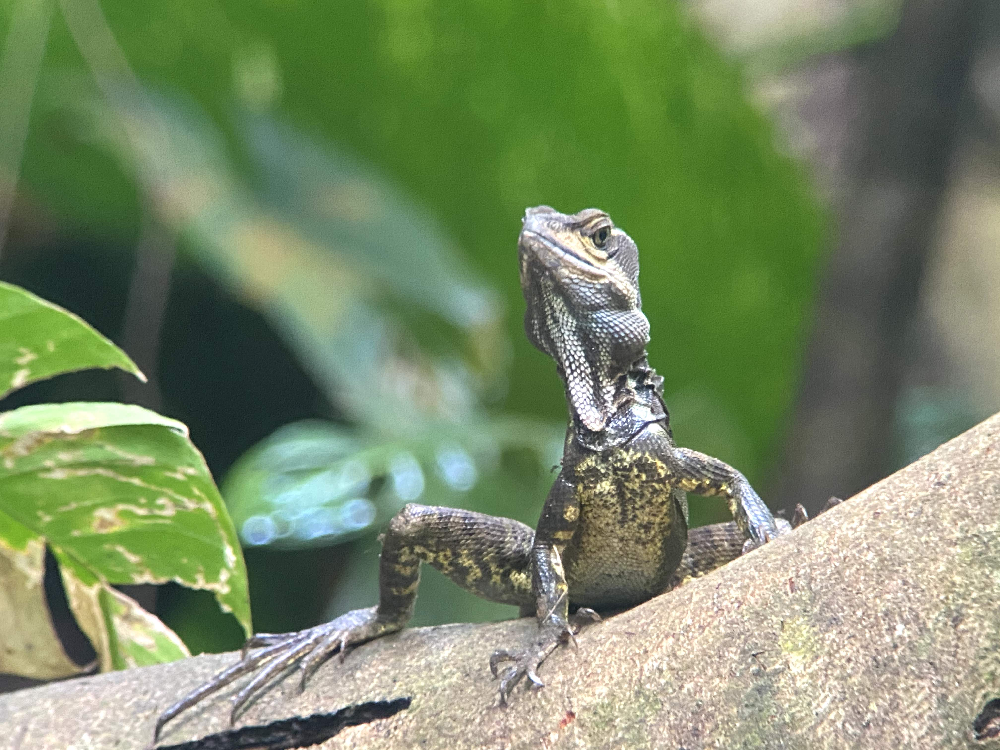
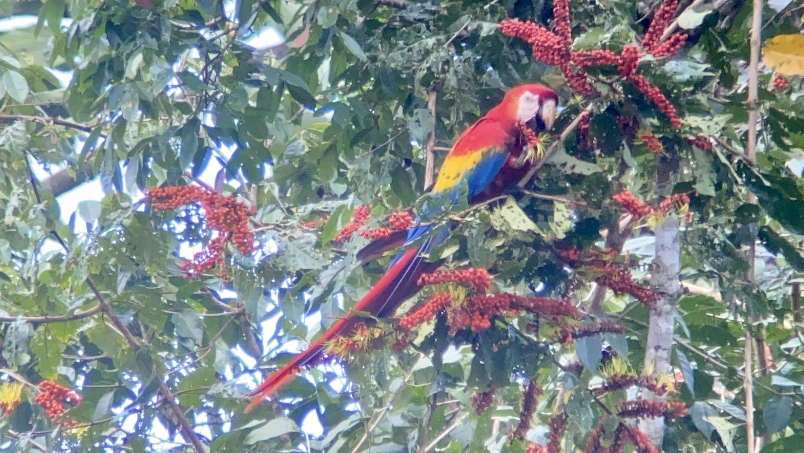
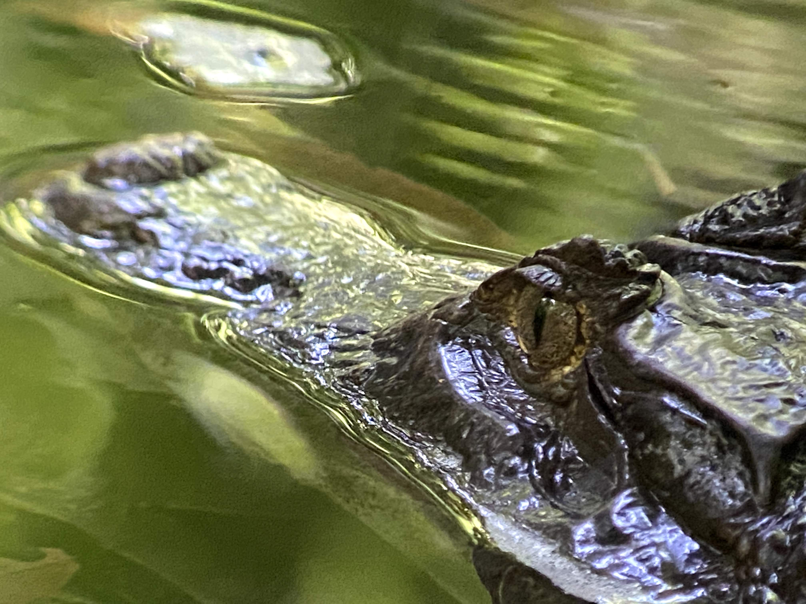
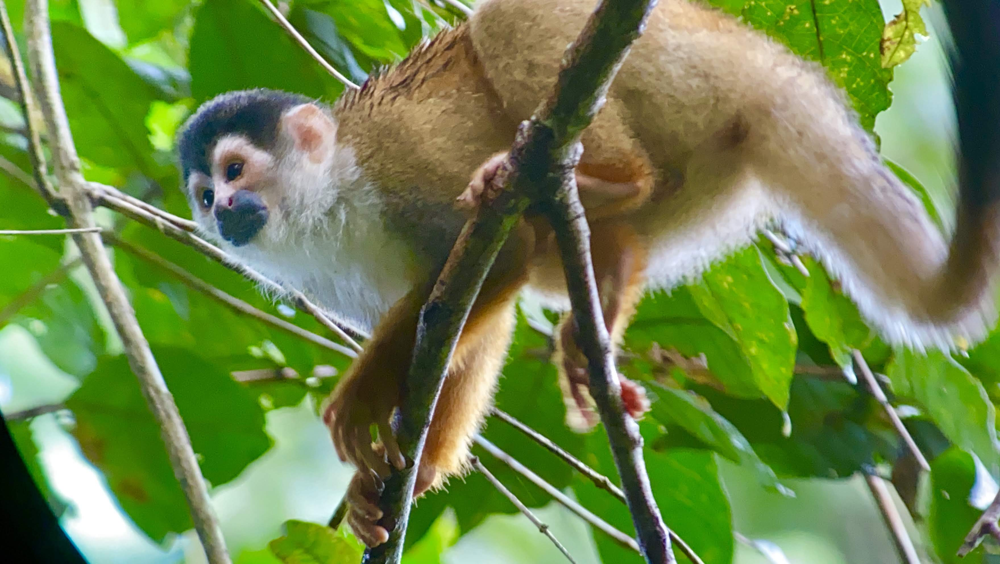
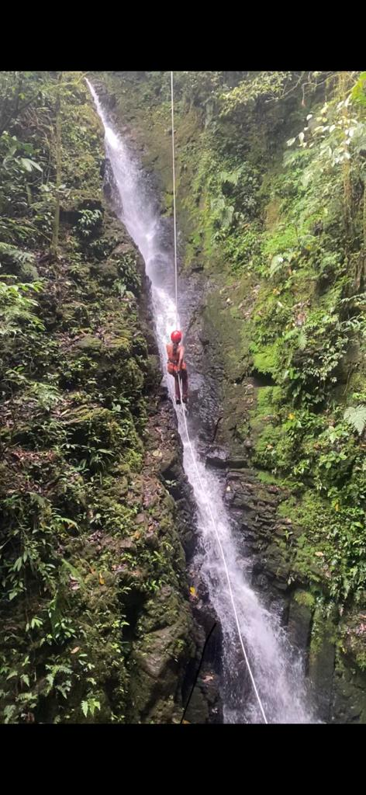
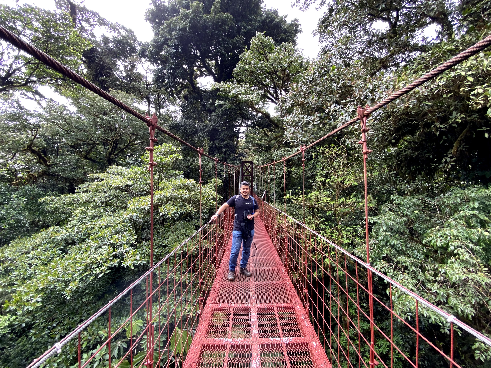
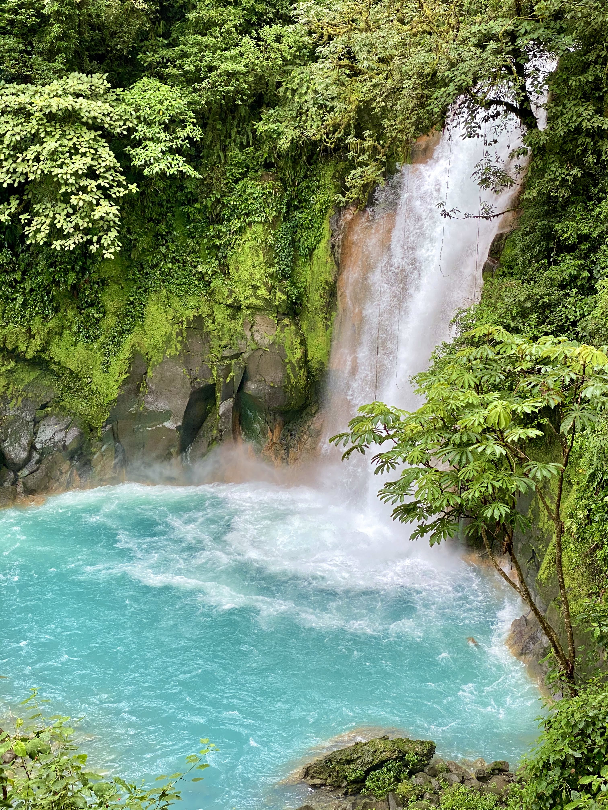
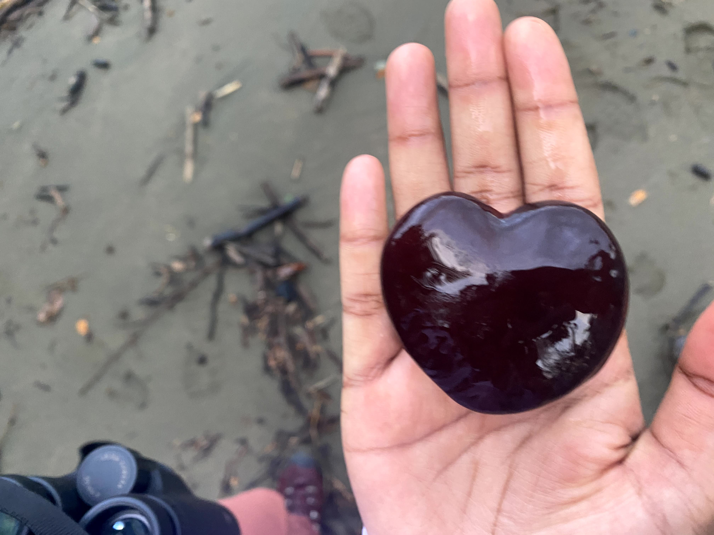

Pura vida!

## Pulmones de la tierra

“Wait, is that a monkey on the tree?” “Is that a sloth?” asked Vinu and I excitedly. “No, that is a Kinkajou, and now it is gone” said Marcos McKoy, our guide. We were walking through a muddy trail during a night hike in the Corcovado National Park.  “Kinkajous are tree dwelling mammals that can turn their feet backwards to run easily in either direction along branches or trunks. They have a prehensile tail” , he continued, while we nodded as if we knew exactly what a prehensile tail was. “The tail is used just like a 5th arm”. Aha! We were hiking through the Osa Peninsula of Costa Rica with a Puerto Jimenez based tour company Osa Wild. We were just an hour away from the town but it still felt remote. ( Any place without network coverage is remote, says Vinu ).

Earlier that evening, a pair of scarlet macaws flew over our heads, a few toucans sparred with their bills on another tree while a red-capped manakin stared into the distance, as if contemplating the next dance move: We knew that we were in one of the most bio-diverse places on Earth but never expected this. It was like we were in a safari that was staged just for us. On top of that, Marcos was providing a constant commentary on the flora and fauna around us. This added to the feeling of us being in a Nat Geo documentary.

The dawn chorus by the birds had us up and ready early the next day. “We are going to walk through the primary rain forests, these are the lungs of the earth aka pulmonew de la tierra” said Marcos as we started our hike. “Shhhh…” said Marcos while pointing up towards the canopy, 30 minutes into our hike. There was a troop of squirrel monkeys right above us. “Squirrel monkeys have a good vocabulary of calls including warning sounds to protect the troop members from predators like falcons” said Marcos, doing his usual commentary. After multiple similar encounters, which included howler monkeys, spider monkeys, baird’s tapir, Savage’s Foam Frog ( aka Bull Frog ), many kinds of birds, and multiple river crossings, which Vinu utterly enjoyed, we reached Sirena where we had a surprise visit from a Collared Peccary!

## Cloud scale Terrarium

“Lean back, lean back!” I was shouting over the waterfall noises. Vinu and I were trying our hand at canyoning. “Can’t do this any more. I need to stop” said a slightly scared Vinu after the fourth waterfall that we came down.  “Its okay.Just stay behind, we have another way” said our guide. Little did we know what was coming next. They literally hung her in the middle of the canyon and asked her to rapple down. I was slightly jealous that she got to do that!

“The sky comes down to the forest, so you can actually walk through the clouds. “ said the forest ranger Mr. Riveira. “But scientific models suggest that this low-level cloud coverage will reduce due to climate change. This could cause the forests’ hydrological cycle to change and even dry it up completely” he warned us as we were taking a leisurely stroll through the trails in the Monteverde cloud forest with him.

“Are you ok? Can you talk?” asked Vinu while staring at me. I had not spoken a word in some time. I was dumb struck by the color of the Rio Celeste river and the waterfall. “The color comes from a mixture of sulfur and calcium carbonate which are seeded into the water from the nearby volcano. “ she explained. ( She is the one that usually plans the trips and likes to do all the research in advance. I like to be surprised ) “I can die peacefully now” as I exhaled.

